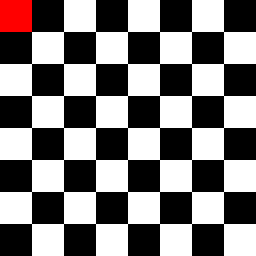
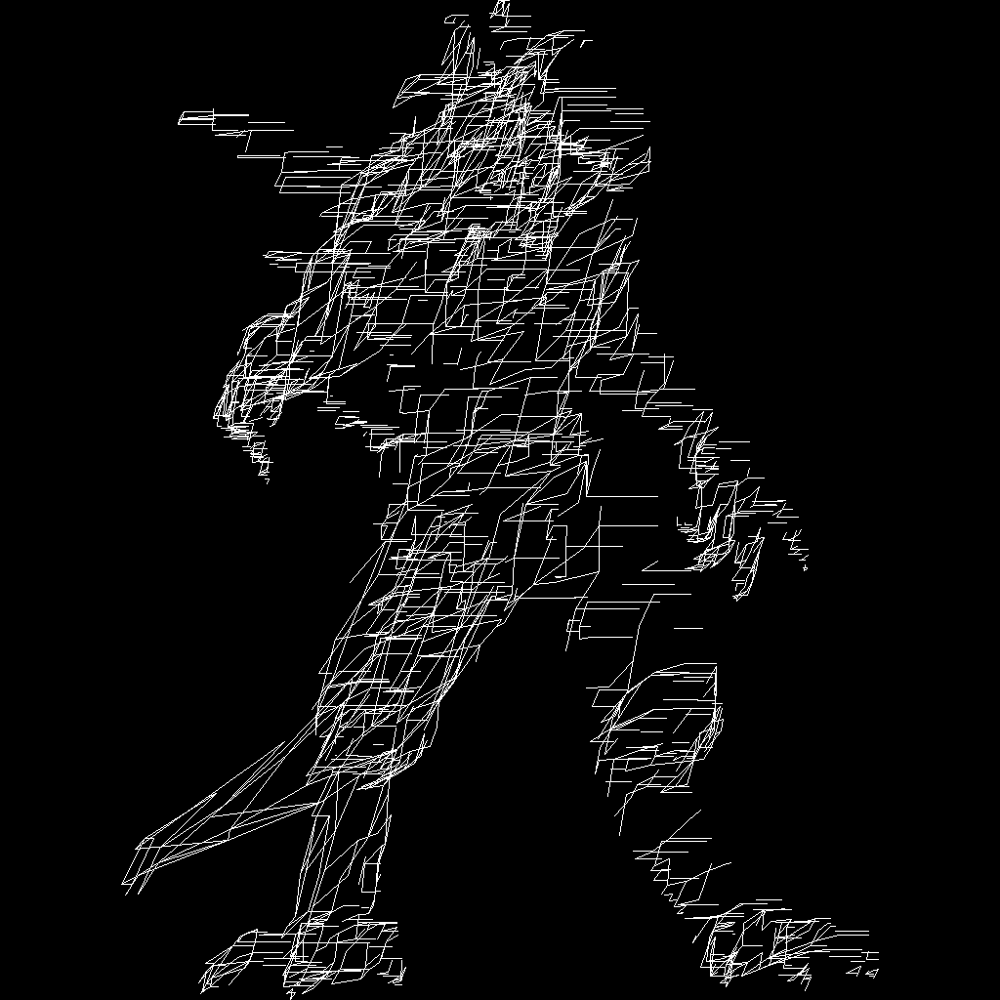

## what is it

Pure CPU software renderer written in Rust, following [Dmitry V. Sokolov's tinyrenderer course](https://github.com/ssloy/tinyrenderer/wiki).

## show me the good stuff! SHOW ME the GOOOOOD stuff it makes

Here is the journey of this renderer so far:

### Test checkerboard patterns to see that TGA output works

### Drawing points and lines, working up to Bresenham's all-integer line-drawing algorithm

### Loading and drawing a model by simply dropping the Z coordinates and drawing triangles

#### These are buggy! I had bugs in my Bresenham code

#### This is correct

